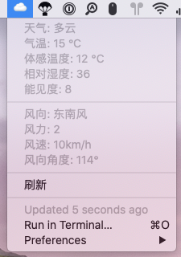

# BitBar – EmojiWeather

Bitbar weather which written in javaScript.



## Usage

1. Run `npm install` or `yarn install`.

2. Rename `.env.example` to `.env`, add [HeWeather](https://dev.heweather.com/) API key and location.

3. Organize your plugin directory structure like this:

   ```bash
   plugins
   ├── BitWeather.{refresh-time}.js -> bitbar-EmojiWeather/BitWeather.js
   └── bitbar-EmojiWeather
       ├── .env
       ├── BitWeather.js
       ├── README.md
       ├── node_modules
       └── package.json
   ```

4. Done, enjoy!

## Special Notes

This script assumes you have [Node.js](https://nodejs.org/) executable at `/usr/local/bin/node`, which should be fine if you've installed it with [HomeBrew](https://brew.sh).

If not, you need to edit the shebang line to specify an alternative one.
